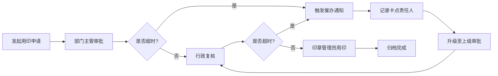

## 1. 产品概述
公司行政公章用印管理Web应用，解决公章使用审批效率低下、超时无人监管、印章批次追溯困难等问题。目标用户为公司行政人员、各部门审批人、印章管理员及高层管理者。

通过数字化管理实现用印申请全流程留痕、超时自动催办升级、印章批次全生命周期管理、问题印章快速召回，提升行政效率，降低用印风险。

## 2. 核心 Features

### 2.1 用户角色

| 角色 | 注册方式 | 核心权限 |
|------|----------|----------|
| 普通员工 | 企业账号登录 | 发起用印申请、查看申请状态 |
| 部门审批人 | 企业账号登录 | 审批本部门用印申请、查看审批任务 |
| 印章管理员 | 企业账号登录 | 管理印章批次、处理召回、查看所有申请 |
| 系统管理员 | 企业账号登录 | 用户管理、超时规则配置、系统设置 |

### 2.2 功能模块

1. **用印申请模块**：用印事由发起、多级审批流程、审批轨迹留痕、申请状态追踪
2. **超时催办模块**：节点超时计时、自动升级催办、卡点人员记录、催办历史查询
3. **印章批次模块**：批次信息录入、效期管理、印章状态监控、库存管理
4. **流向召回模块**：批次流向追踪、按批号反查部门、召回通知发起、召回状态跟踪

### 2.3 页面详情

| 页面名称 | 模块名称 | 功能描述 |
|---------|----------|----------|
| 首页/仪表盘 | 数据概览 | 待办审批数、超时预警、用印统计、召回状态概览 |
| 用印申请列表 | 用印申请 | 申请列表展示、筛选搜索、新建申请入口 |
| 用印申请详情 | 用印申请 | 申请详情、审批轨迹、操作记录、当前状态 |
| 新建用印申请 | 用印申请 | 事由填写、印章选择、附件上传、提交审批 |
| 超时催办列表 | 超时催办 | 超时任务列表、卡点记录、催办状态、升级处理 |
| 催办详情页 | 超时催办 | 超时节点详情、催办历史、升级记录、卡点分析 |
| 印章批次列表 | 印章批次 | 批次列表、效期状态、库存数量、搜索筛选 |
| 批次详情页 | 印章批次 | 批次信息、印章明细、流向记录、效期管理 |
| 新建批次页 | 印章批次 | 批次信息录入、印章导入、效期设置 |
| 流向追踪页 | 流向召回 | 按批号查询、流向地图、部门列表、召回入口 |
| 召回管理页 | 流向召回 | 召回列表、通知记录、召回进度、状态跟踪 |
| 发起召回页 | 流向召回 | 选择批次、填写原因、通知部门、提交召回 |

## 3. 核心流程

### 3.1 用印申请审批流程
员工发起用印申请 → 系统生成审批节点 → 部门主管审批 → 行政复核 → 印章管理员用印 → 归档。
任一节点超时未处理 → 系统自动计时 → 到达阈值触发催办 → 超时升级至上级 → 记录卡点责任人。

### 3.2 印章批次召回流程
发现问题印章 → 输入批号查询 → 系统展示流向部门 → 发起召回通知 → 各部门确认回收 → 印章管理员核销 → 批次报废/重制。

## 4. 用户界面设计

### 4.1 设计风格
- **主色调**：深靛蓝 #1e3a5f（专业、稳重、信任感）
- **辅助色**：琥珀橙 #f59e0b（超时预警）、翡翠绿 #10b981（正常状态）、玫红 #ef4444（紧急/召回）
- **背景色**：冷灰白 #f8fafc，卡片深灰 #ffffff
- **按钮风格**：微圆角（6px）、微妙阴影、悬停上浮效果
- **字体**：标题使用 Noto Serif SC（正式感），正文使用 LXGW WenKai（清晰易读）
- **布局风格**：左右分栏布局，左侧导航，右侧内容区，卡片式信息展示
- **图标风格**：线性图标，统一2px描边，配合状态色彩区分

### 4.2 页面设计概述

| 页面名称 | 模块名称 | UI元素 |
|---------|----------|--------|
| 首页/仪表盘 | 数据概览 | 统计卡片网格、超时预警横幅、审批进度环形图、用印趋势折线图、最近申请列表 |
| 用印申请列表 | 用印申请 | 顶部搜索筛选栏、数据表格、状态标签、分页控件、新建按钮 |
| 新建用印申请 | 用印申请 | 分步表单、印章选择器、文件上传区、实时预览、提交按钮 |
| 超时催办列表 | 超时催办 | 超时倒计时标签、卡点人高亮、催办状态徽章、升级操作按钮 |
| 印章批次列表 | 印章批次 | 批次卡片、效期进度条、状态指示灯、库存角标 |
| 流向追踪页 | 流向召回 | 搜索框、流向关系图、部门列表、召回快捷按钮 |
| 召回管理页 | 流向召回 | 召回时间线、部门响应状态、进度追踪条 |

### 4.3 响应式
- 桌面端优先设计，支持1280px以上分辨率
- 平板端适配：导航折叠为图标模式，表格转为卡片列表
- 移动端：单列布局，底部Tab导航，关键操作按钮悬浮
- 所有交互元素支持触控操作，最小触控区域44px

### 4.4 动效设计
- 页面加载：元素淡入上移，错落延迟（staggered reveal）
- 状态变化：数字滚动动画、进度条平滑过渡
- 超时预警：呼吸灯效果（pulse animation）
- 审批轨迹：时间线节点逐步绘制
- 悬停效果：卡片轻微上浮+阴影加深
