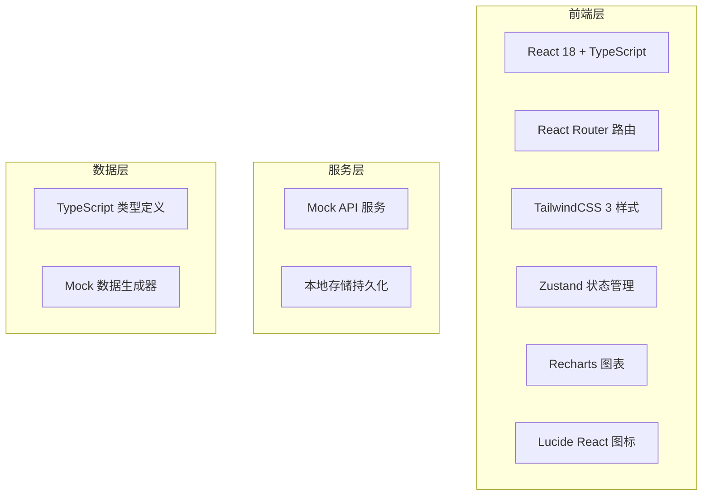
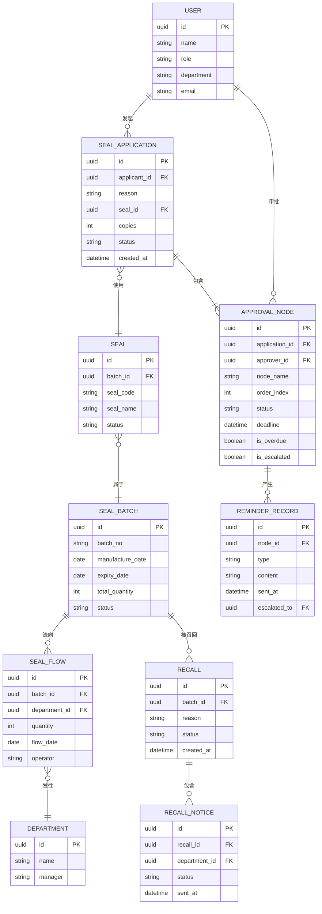

## 1. 架构设计



## 2. 技术描述

- **前端框架**：React@18 + TypeScript@5 + Vite@5
- **路由管理**：React Router DOM@6
- **样式方案**：TailwindCSS@3 + PostCSS
- **状态管理**：Zustand@4（轻量级状态管理，替代Redux减少样板代码）
- **UI组件**：自定义组件库（避免使用通用组件库如Antd，保持设计独特性）
- **图表库**：Recharts@2（数据可视化）
- **图标库**：Lucide React（线性图标）
- **构建工具**：Vite@5
- **数据方案**：前端Mock数据 + LocalStorage持久化，无后端服务
- **数据模拟**：MSW（Mock Service Worker）或纯函数模拟API

## 3. 路由定义

| 路由路径 | 页面组件 | 功能 |
|---------|---------|------|
| / | Dashboard | 首页仪表盘 |
| /applications | ApplicationList | 用印申请列表 |
| /applications/new | NewApplication | 新建用印申请 |
| /applications/:id | ApplicationDetail | 用印申请详情 |
| /reminders | ReminderList | 超时催办列表 |
| /reminders/:id | ReminderDetail | 催办详情 |
| /batches | BatchList | 印章批次列表 |
| /batches/new | NewBatch | 新建印章批次 |
| /batches/:id | BatchDetail | 批次详情 |
| /trace | TracePage | 流向追踪 |
| /recalls | RecallList | 召回管理 |
| /recalls/new | NewRecall | 发起召回 |

## 4. 数据模型

### 4.1 ER图



### 4.2 数据类型定义

```typescript
// 用户类型
interface User {
  id: string;
  name: string;
  role: 'employee' | 'approver' | 'seal_admin' | 'system_admin';
  department: string;
  departmentId: string;
  email: string;
}

// 用印申请
interface SealApplication {
  id: string;
  applicantId: string;
  applicantName: string;
  department: string;
  reason: string;
  sealId: string;
  sealName: string;
  copies: number;
  status: 'pending' | 'approved' | 'rejected' | 'completed' | 'cancelled';
  attachments: string[];
  createdAt: string;
  currentNodeIndex: number;
  approvalNodes: ApprovalNode[];
}

// 审批节点
interface ApprovalNode {
  id: string;
  applicationId: string;
  approverId: string;
  approverName: string;
  nodeName: string;
  orderIndex: number;
  status: 'pending' | 'approved' | 'rejected' | 'escalted';
  deadline: string;
  approvedAt?: string;
  comment?: string;
  isOverdue: boolean;
  isEscalated: boolean;
  overdueHours: number;
  reminders: ReminderRecord[];
}

// 催办记录
interface ReminderRecord {
  id: string;
  nodeId: string;
  type: 'normal' | 'escalation';
  content: string;
  sentAt: string;
  escalatedTo?: string;
  escalatedToName?: string;
}

// 印章
interface Seal {
  id: string;
  batchId: string;
  sealCode: string;
  sealName: string;
  sealType: string;
  status: 'in_stock' | 'in_use' | 'recalled' | 'expired' | 'destroyed';
  currentHolder?: string;
  currentDepartment?: string;
}

// 印章批次
interface SealBatch {
  id: string;
  batchNo: string;
  sealType: string;
  manufactureDate: string;
  expiryDate: string;
  totalQuantity: number;
  remainingQuantity: number;
  status: 'active' | 'expired' | 'recalled' | 'destroyed';
  remark?: string;
}

// 印章流向
interface SealFlow {
  id: string;
  batchId: string;
  departmentId: string;
  departmentName: string;
  quantity: number;
  flowDate: string;
  operator: string;
  seals: string[];
}

// 部门
interface Department {
  id: string;
  name: string;
  manager: string;
  managerId: string;
  location: string;
}

// 召回记录
interface Recall {
  id: string;
  batchId: string;
  batchNo: string;
  reason: string;
  status: 'pending' | 'in_progress' | 'completed' | 'cancelled';
  createdAt: string;
  initiatedBy: string;
  notices: RecallNotice[];
}

// 召回通知
interface RecallNotice {
  id: string;
  recallId: string;
  departmentId: string;
  departmentName: string;
  status: 'sent' | 'read' | 'confirmed' | 'rejected';
  sentAt: string;
  confirmedAt?: string;
  confirmedQuantity?: number;
  remark?: string;
}
```

## 5. 目录结构

```
src/
├── assets/          # 静态资源
├── components/      # 通用组件
│   ├── ui/          # 基础UI组件
│   │   ├── Button.tsx
│   │   ├── Card.tsx
│   │   ├── Table.tsx
│   │   ├── Badge.tsx
│   │   ├── Input.tsx
│   │   ├── Modal.tsx
│   │   ├── Progress.tsx
│   │   └── Timeline.tsx
│   ├── layout/      # 布局组件
│   │   ├── Sidebar.tsx
│   │   ├── Header.tsx
│   │   └── Layout.tsx
│   └── charts/      # 图表组件
│   └── common/      # 业务通用
├── pages/           # 页面组件
│   ├── Dashboard/
│   ├── Application/
│   ├── Reminder/
│   ├── Batch/
│   ├── Trace/
│   └── Recall/
├── store/           # 状态管理
│   ├── useApplicationStore.ts
│   ├── useBatchStore.ts
│   ├── useReminderStore.ts
│   ├── useRecallStore.ts
│   └── useUserStore.ts
├── types/           # 类型定义
│   └── index.ts
├── mock/           # Mock数据
│   ├── data/
│   │   ├── applications.ts
│   │   ├── batches.ts
│   │   ├── users.ts
│   │   ├── departments.ts
│   │   └── recalls.ts
│   └── api/
│       ├── applicationApi.ts
│       ├── batchApi.ts
│       ├── reminderApi.ts
│       └── recallApi.ts
├── utils/           # 工具函数
│   ├── date.ts
│   ├── status.ts
│   └── validation.ts
├── hooks/           # 自定义Hooks
│   ├── useOverdueTimer.ts
│   └── useApprovalFlow.ts
├── App.tsx
├── main.tsx
└── index.css
```

## 6. 核心功能实现要点

### 6.1 超时计时机制
- 使用自定义Hook `useOverdueTimer` 实现实时超时倒计时
- 每个审批节点设置deadline，实时计算剩余时间
- 超时状态自动触发催办逻辑
- LocalStorage持久化超时记录

### 6.2 自动升级催办
- 配置超时规则：一级催办（24h）→ 二级催办（48h）→ 升级上级（72h）
- 记录每次催办历史和卡点责任人
- 生成卡点统计分析

### 6.3 批次流向追溯
- 按批号关联流向记录表
- 支持正向追踪：批次 → 部门 → 持有人
- 反向追溯：印章 → 批次 → 所有流向部门

### 6.4 召回流程
- 召回发起后自动生成各部门通知
- 追踪各部门召回确认状态
- 召回进度实时统计
